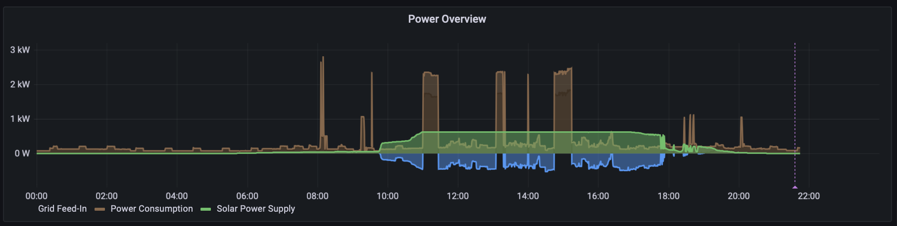

# My Grafana Panels

- [Energy Traffic Light](#energy-traffic-light)
- [Solar vs. Grid Power](#solar-vs-grid-power)

## Energy Traffic Light

[Config](panels/energy-traffic-light.json)

Shows the share of renewable energy within the German electricity mix thanks to free data from [energy-charts.info](https://api.energy-charts.info)

Grafana Datasources:

- [Infinity](https://grafana.com/grafana/plugins/yesoreyeram-infinity-datasource/)

## Solar vs. Grid Power

[Config](panels/solar-vs-grid-power.json)

Shows overall power demand in the house or appartment (brown) vs. the solar power supply (green) and the grid feed-in (blue) if not all solar power is consumed.

Grafana Datasources:

- [Influx DB](https://grafana.com/grafana/plugins/influxdb/?src=ggl-s&mdm=cpc&camp=nb-influxdb-bmm&cnt=145265838431&trm=influxdb%20dashboard&device=c&gclid=CjwKCAjwh8mlBhB_EiwAsztdBDmwKYCQVGRvmo2Lpx-5Kiq0RVKCROihHKMxeqX_DBIQrhYIGthEKRoCXvMQAvD_BwE)
